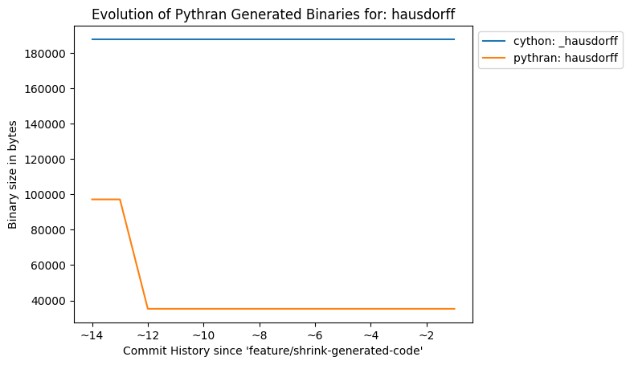
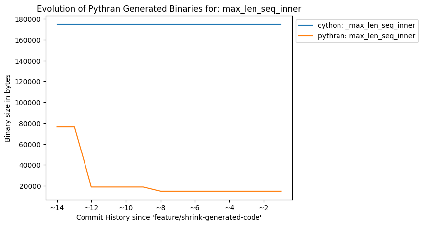
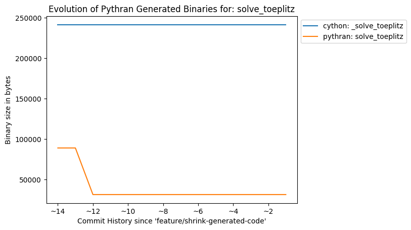

Shrinking Pythran-Generated Binaries
####################################

:date: 2018-01-29
:category: optimisation
:lang: en
:authors: serge-sans-paille
:summary: Following a `thread on scipy-dev <https://mail.python.org/pipermail/scipy-dev/2018-January/022325.html>`_, I've started to work on reducing the size of Pythran-generated binaries. Here is the outcome of my work.

Testbed
=======

So the question was: do Pythran-generated binaries use more disk space than Cython ones?

I first pick a few Cython files from the Scipy code base. Those are files that can easily be converted back to Python so that Pythran can process them (remember, Pythran only processes pure Python code).

- ``directed_hausdorff``: [`_hausdorff.pyx <https://github.com/scipy/scipy/blob/master/scipy/spatial/_hausdorff.pyx>`_] [`hausdorff.py <https://github.com/serge-sans-paille/pythran/blob/0d246b22ced40d39f392a09be04ab11b11c363c5/pythran/tests/scipy/hausdorff.py>`_]

- ``max_len_seq_inner``: [`max_len_seq_inner.pyx <https://github.com/scipy/scipy/blob/master/scipy/signal/_max_len_seq_inner.pyx>`_] [`max_len_seq_inner.py <https://github.com/serge-sans-paille/pythran/blob/0d246b22ced40d39f392a09be04ab11b11c363c5/pythran/tests/scipy/max_len_seq_inner.py>`_]

- ``levinson``, Solves a linear Toeplitz system using Levinson recursion: [`_solve_toeplitz.pyx <https://github.com/scipy/scipy/blob/master/scipy/linalg/_solve_toeplitz.pyx>`_] [`solve_toeplitz.py <https://github.com/serge-sans-paille/pythran/blob/0d246b22ced40d39f392a09be04ab11b11c363c5/pythran/tests/scipy/solve_toeplitz.py>`_]

- ``lombscargle``, Computes the Lomb-Scargle periodogram: [`_spectral.pyx <https://github.com/scipy/scipy/blob/master/scipy/signal/_spectral.pyx>`_] [`spectral.py <https://github.com/serge-sans-paille/pythran/blob/0d246b22ced40d39f392a09be04ab11b11c363c5/pythran/tests/scipy/spectral.py>`_]

To the notable exception of ``spectral.py`` that uses high level ``numpy.sum(x, axis=1)`` construct, the Pythran code is generally a rewrite of the Cython code with types and annotation pruned, plus a few syntactic sugar from Python like the ``for: ... else:..`` statement used in ``hausdorff.py``.

For reference, I compiled the Cython code using the rather old school ``cython
src.pyx && gcc -shared -fPIC `python-config --cflags --libs` -o src.so -O2``
command line, then stripped the resulting binary using ``strip src.so``. The
later command is used to be fair with Pythran, that automatically adds
``-Wl,-strip-all`` flag during compilation (both have the same effect of
stripping the binary from debug information and useless ELF sections).

Commit History
==============

The following figures illustrate the history of binary size throughout the recent Pythran commit history, using the Cython binary as a base line.

.. image:: ./images/2018-01-29-spectral.so.png
    :alt: Evolution of binary size for 'spectral.so'
    :height: 20em
    :align: center

So a lot of things actually happened :-) Let me explain that.

Controlling Symbols
*******************

The first commit around ``HEAD~12`` was the most relevant one. Digging through the output of ``nm
-C`` on Pythran generated binaries, I noticed quite a lot of symbols that were
of no use for the generated binaries; But they were present because Pythran
uses the ``pythonic`` header only libraries and as such, when it includes some
headers, the symbol defined end up in the binary. They are actually marked as
``hidden`` because of the ``-fvisibility=hidden`` flag, but they are still
there (this flag mostly affects the linker). I ended up adding an (optional)
anonymous namespace right below the ``pythonic`` namespace, which effectively
marks all symbols as internal symbols, so the compiler can remove them
relatively early in the compilation process.

There's also a small shrink around ``HEAD~9``. This is due to some symbols that
were just hanging around in the global namespace, but they happened to be
useless :-)

Avoiding Copies
***************

The stats for ``spectral.py`` were not so good, even after the initial
reduction. While digging through the generated assembly code, I noticed a lot
of register spill, ended up with a lot of ``mov``. It turns out my expression
template code was making a bunch of copies of its argument, which is sometimes
necessary (when the expression template *owns* its argument) but sometimes not.
Not a big deal as pythonic object use a shared reference counter, but still,
avoiding that would certainly shrink the generated binaries. Turns out that was
a correct guess. And it also speeds up the execution of the code, less spilling
is generally a good thing :-)

About Specialization
********************

It may looks strange to have all Pythran binaries thiner that Cython's, except
``spectral.so``. This is explained by the fact that Pythran generates code to
handle broadcasting, actually generating two versions for each complex
expression: one with broadcasting and one without. Twice the code, twice the
fat :-)

That gives me an optimization hint: being able to symbolically compute
expression size may turn dynamic broadcasting into static broadcasting, I need
to dig on that idea.

Going Further
=============

Let's have a look to the two version of ``hausdorff`` binaries:

.. code::

    $ readelf -SW hausdorff.so _hausdorff.so

    File: hausdorff.so
    There are 28 section headers, starting at offset 0x17490:

    Section Headers:
      [Nr] Name              Type            Address          Off    Size   ES Flg Lk Inf Al
      [ 0]                   NULL            0000000000000000 000000 000000 00      0   0  0
      [ 1] .note.gnu.build-id NOTE           00000000000001c8 0001c8 000024 00   A  0   0  4
      [ 2] .gnu.hash         GNU_HASH        00000000000001f0 0001f0 00006c 00   A  3   0  8
      [ 3] .dynsym           DYNSYM          0000000000000260 000260 000618 18   A  4   1  8
      [ 4] .dynstr           STRTAB          0000000000000878 000878 000818 00   A  0   0  1
      [ 5] .gnu.version      VERSYM          0000000000001090 001090 000082 02   A  3   0  2
      [ 6] .gnu.version_r    VERNEED         0000000000001118 001118 0000a0 00   A  4   3  8
      [ 7] .rela.dyn         RELA            00000000000011b8 0011b8 000378 18   A  3   0  8
      [ 8] .rela.plt         RELA            0000000000001530 001530 000378 18  AI  3  23  8
      [ 9] .init             PROGBITS        00000000000018a8 0018a8 000017 00  AX  0   0  4
      [10] .plt              PROGBITS        00000000000018c0 0018c0 000260 10  AX  0   0 16
      [11] .plt.got          PROGBITS        0000000000001b20 001b20 000008 08  AX  0   0  8
      [12] .text             PROGBITS        0000000000001b30 001b30 004c78 00  AX  0   0 16
      [13] .fini             PROGBITS        00000000000067a8 0067a8 000009 00  AX  0   0  4
      [14] .rodata           PROGBITS        00000000000067c0 0067c0 000900 00   A  0   0 32
      [15] .eh_frame_hdr     PROGBITS        00000000000070c0 0070c0 0000e4 00   A  0   0  4
      [16] .eh_frame         PROGBITS        00000000000071a8 0071a8 000650 00   A  0   0  8
      [17] .gcc_except_table PROGBITS        00000000000077f8 0077f8 0001d1 00   A  0   0  4
      [18] .init_array       INIT_ARRAY      0000000000207cf0 007cf0 000010 08  WA  0   0  8
      [19] .fini_array       FINI_ARRAY      0000000000207d00 007d00 000008 08  WA  0   0  8
      [20] .data.rel.ro      PROGBITS        0000000000207d08 007d08 000060 00  WA  0   0  8
      [21] .dynamic          DYNAMIC         0000000000207d68 007d68 000230 10  WA  4   0  8
      [22] .got              PROGBITS        0000000000207f98 007f98 000068 08  WA  0   0  8
      [23] .got.plt          PROGBITS        0000000000208000 008000 000140 08  WA  0   0  8
      [24] .data             PROGBITS        0000000000208140 008140 000088 00  WA  0   0 32
      [25] .bss              NOBITS          00000000002081e0 0081c8 002758 00  WA  0   0 32
      [26] .comment          PROGBITS        0000000000000000 0081c8 00001d 01  MS  0   0  1
      [27] .shstrtab         STRTAB          0000000000000000 0081e5 000100 00      0   0  1

    (...)

    File: _hausdorff.so
    There are 26 section headers, starting at offset 0x2d6e8:

    Section Headers:
      [Nr] Name              Type            Address          Off    Size   ES Flg Lk Inf Al
      [ 0]                   NULL            0000000000000000 000000 000000 00      0   0  0
      [ 1] .note.gnu.build-id NOTE           00000000000001c8 0001c8 000024 00   A  0   0  4
      [ 2] .gnu.hash         GNU_HASH        00000000000001f0 0001f0 000040 00   A  3   0  8
      [ 3] .dynsym           DYNSYM          0000000000000230 000230 000f00 18   A  4   1  8
      [ 4] .dynstr           STRTAB          0000000000001130 001130 000aec 00   A  0   0  1
      [ 5] .gnu.version      VERSYM          0000000000001c1c 001c1c 000140 02   A  3   0  2
      [ 6] .gnu.version_r    VERNEED         0000000000001d60 001d60 000070 00   A  4   2  8
      [ 7] .rela.dyn         RELA            0000000000001dd0 001dd0 0026b8 18   A  3   0  8
      [ 8] .rela.plt         RELA            0000000000004488 004488 000a98 18  AI  3  21  8
      [ 9] .init             PROGBITS        0000000000004f20 004f20 000017 00  AX  0   0  4
      [10] .plt              PROGBITS        0000000000004f40 004f40 000720 10  AX  0   0 16
      [11] .plt.got          PROGBITS        0000000000005660 005660 000008 08  AX  0   0  8
      [12] .text             PROGBITS        0000000000005670 005670 01f753 00  AX  0   0 16
      [13] .fini             PROGBITS        0000000000024dc4 024dc4 000009 00  AX  0   0  4
      [14] .rodata           PROGBITS        0000000000024de0 024de0 002e48 00   A  0   0 32
      [15] .eh_frame_hdr     PROGBITS        0000000000027c28 027c28 000444 00   A  0   0  4
      [16] .eh_frame         PROGBITS        0000000000028070 028070 002508 00   A  0   0  8
      [17] .init_array       INIT_ARRAY      000000000022aca0 02aca0 000008 08  WA  0   0  8
      [18] .fini_array       FINI_ARRAY      000000000022aca8 02aca8 000008 08  WA  0   0  8
      [19] .dynamic          DYNAMIC         000000000022acb0 02acb0 000210 10  WA  4   0  8
      [20] .got              PROGBITS        000000000022aec0 02aec0 000140 08  WA  0   0  8
      [21] .got.plt          PROGBITS        000000000022b000 02b000 0003a0 08  WA  0   0  8
      [22] .data             PROGBITS        000000000022b3a0 02b3a0 002248 00  WA  0   0 32
      [23] .bss              NOBITS          000000000022d600 02d5e8 000768 00  WA  0   0 32
      [24] .comment          PROGBITS        0000000000000000 02d5e8 00001d 01  MS  0   0  1
      [25] .shstrtab         STRTAB          0000000000000000 02d605 0000e1 00      0   0  1

Special `glasses <http://gatherer.wizards.com/Pages/Card/Details.aspx?multiverseid=639>`_ help to read through these numbers, but basically:

- The `.text` section, *i.e.* where code lies, is larger on Cython-generated binary, by a factor of ~4 on that binary.

- The `.plt` and `.plt.got` sections, *i.e.* relocation informations are also larger. This is because Cython uses a lot of symbols fro the ``libpython`` while Pythran only uses some Python <> Native converters. This is confirmed by the number of dynamic symbols collected by `` nm -D _hausdorff.so | wc -l``: **159** in the case of Cython-generated binary and **64** for the Pythran version.

- The `.rodata` section also contains more information in Cython case. A quick look at its content with ``objdump -s -j.rodata _hausdorff.so`` outputs a lot of documentation, error message etc. Looks like Cython takes more care on error message than Pythran :-)

Note that some sections could be removed using ``strip -r``: I suspect ``.note.gnu.build-id`` and ``.comment`` are not critical.

Conclusion
==========

Pythran generates code that does not make any call to the Python C API. Cython
does. Even when the user does its best to remove them for computation
critical-parts, it's just not the same guarantee. This has an impact on code
size.

But Cython is also more mature, so it's probable that some of its checks that
make the code larger may find their way into Pythran generated code too.

Oh, and thanks to the reduction of number of copies, the expression template engine of Pythran got better. That's an unexpected but pleasant side-effect ``\o/``
