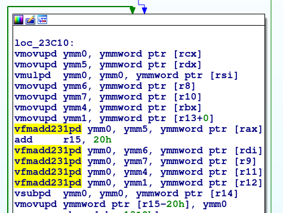

Getting the best of every world: Cython and Pythran working together
####################################################################

:date: 2018-08-05
:category: cython
:lang: en
:authors: Adrien Guinet

Once upon a time, on IRC, Serge Guelton asked me whether I wanted to work on
having Cython using Pythran for Numpy-related computation. I wasn't really sure
what I was getting into, but I've always liked optimizing software, and that
sounded like an interesting challenge to understand both projects.
As an also important interesting note, this whole project has been financed by
the OpenDreamKit project!

That's the end of the small story, now let's get to the real stuff!

Why mixing Cython and Pythran?
------------------------------

On one side, when Cython code contains operations which are done on Numpy
arrays, Cython relies on the original Numpy package to compute them. This
involves a fall back to the Python interpreter. It thus misses several
optimization opportunities, especially with complex expressions.

On the other side, Pythran has a full C++ implementation of a major set of
the Numpy API. Some of the advantage of this implementation is that it supports
expression templates and SIMD instructions. Expression templates allow to
"fuse" loops that can occurs when expressions with multiple operators are
computed. For instance, the expression "a+b*c" will original be transformed by
Cython in two call: one for the multiplication of b by c, and one for the
addition of the result of this multiplication and the addition by a. Each call
will end-up in one loop, that will read memory, compute the operation and write
back to memory. The second loop will have the same pattern. In nowadays
architecture, memory bandwidth is often the limiting factor in this kind of
operation. It is thus really interesting to merge these loops, and load/store
the memory only once.  Expression templating is a C++ technique that allows to
evaluate expressions only when they are stored to memory. Thus, in this case,
the two loops will be automatically "merged" by the C++ compiler, and we'll get
an optimized version of this code. Note that this technique is used for
instance by the C++ wrapper of the GMP library.

The project has been focused on using this Pythran backend for Numpy arrays in
Cython when possible. At the time of writing this integration, Pythran had a
few limitations regarding the Numpy arrays it can handle:

* array "views" are not supported. That means that arrays must be stored in
  contiguous memory. Fortran and C-style format are supported.
* the endianess of the integers must be the same that the one of the targeted
  architecture (note that Cython has the same limitation, and that it is still
  true today)

Implementation details within Cython
------------------------------------

The overall idea of the implementation of this feature is to generate code that
is using the pythonic backend instead of calls to the Numpy Python functions.
Moreover, as Pythran didn't support every Numpy array types, we need a
mechanism to switch back to the original implementation if necessary.

In order to explain this, let's take an example with this simple Cython function:

.. code:: py

  import numpy as np
  cimport numpy as np
  def add(np.ndarray(double, ndim=1) a, np.ndarray(double, ndim=1) b):
      return a+b

When we encounter such a definition, we want to generate various functions, depending on the shapes of ``a`` and ``b`` at runtime:

* the original Cython code, if ``a`` and ``b`` can't be handled by Pythran
* the version when only ``a`` can be handled by Pythran
* the version when only ``b`` can be handled by Pythran
* the version when both ``a`` and ``b`` can be handled by Pythran

We can note that, in the case of the ``add`` function, only the first and last
versions are really of value. For now, we don't try to be smart about this and
generate all of these versions.

In order to do that, we rely on the type infrastructure that already exists in
Cython. For every argument that is a potentially Pythran-supported Numpy array,
we convert its type into a Cython ``FusedType``. A ``FusedType`` allows to declare a
union of type. Multiple ``FusedType`` can be specified within a function. In
the case of our ``add`` function, this will generate the four aforementioned
versions, and the dispatching is done at runtime. What's nice is that we just
need to declare these ``FusedType`` types, and Cython already handled all this
dispatching and the generation of the various functions.

Once this is done, we use these rules to known when we can generation
pythonic-based code:

* unary and binary operators of two pythonic arrays is a supported operation
* calling a function of a module implemented in Pythran is a supported operation

If none of these rules work out, we fall back to Python objects and use the
original Cython implementation.

How to use it
-------------

The Pythran-Numpy backend isn't activated by default within Cython. There are
multiple ways to activate it:

* if you are using Cython directly from the command line, you can pass the
  ``--np-pythran`` flag to the ``cython`` program
* if you are using ``distutils``, you can just add a comment with ``# cython:
  np_pythran=True`` at the top of the necessary Cython files

More detailed information can be found within the Cython documentation
(https://cython.readthedocs.io/en/latest/src/userguide/numpy_pythran.html).

Some benchmarks
---------------

Here goes the important part: do we actually gain performances?

Let's look at an example:

.. code:: python

   def kernel(np.ndarray[double, ndim=1] a, np.ndarray[double, ndim=1] b, \
         np.ndarray[double, ndim=1] c):
         return (a*a+b*a+c*b+a*a+b*b+c*c)-a-b

Here are the results, for arrays of 1000000 elements:

* classical Cython: 20.2 ms ± 0.9 ms
* Cython with Numpy-Pythran: 5.5369 ms ± 0.0645 ms
* Cython with Numpy-Pythran and SIMD optimisations: 2.1336 ms ± 0.2 ms

If we take a look at the generated x86 code, here is what we see for the
original Cython code:

.. image:: images/cython_pure.png
   align: center

We can basically see that calls to the C Python API are made, which will call
the underlying Numpy implementation.

On the other hand, the Cython+Pythran+SIMD generated code looks like this:

   align: center

What we can see is that we only have one loop that does the full computation
using vector instructions (AVX2 in this case). This is the perfect case where
expression templates combined with vectorization show their interest!

Future work
-----------

Pythran does not support yet memory views, while Cython has support for this.
Memory views are an official CPython API to transparently forward buffers back
and forth from native world to Python. As Numpy arrays, they support various
shapes and ordering. Numpy arrays can also be processed as memory views. The
next move for Pythran would be to support this, and for Cython to be able to
use the Pythran backend for memory views!
