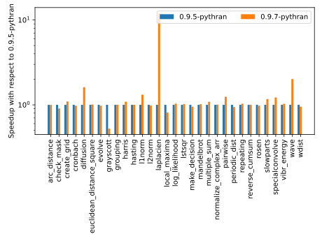
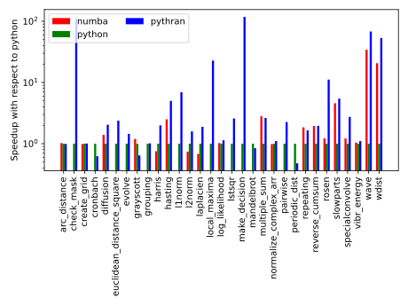

Pythran 0.9.7 - memes tra
#########################

:date: 2020-09-23
:category: release
:lang: en
:authors: serge-sans-paille
:summary: Pythran version bump, supporting Python 3.9, fixing a few performance issues and benchmarking
          the release.

Fedora *rawhide* has been moving to Python 3.9, which `broke the Pythran package
<https://bugzilla.redhat.com/show_bug.cgi?id=1818006>`__. This is unsurprising,
as Python 3.9 changes the `ast <https://docs.python.org/3/library/ast.html>`_
representation, so `GAST <https://github.com/serge-sans-paille/gast>`_ and
`Beniget <https://github.com/serge-sans-paille/beniget>`_, two packages *Pythran*
depends on for the AST abstraction, needed to adapt.  As of *Pythran* **0.9.7**,
*GAST* has moved to **0.4.0** and *Beniget* to **0.3.0**, both support Python 3.9
and all these packages are now compatible. Good.

With version 0.9.6, *Pythran* introduced a new *NumPy* expression computation engine
that solved a few issues but also introduced a performance regression for
various kernels. I've been working on fixing that aspect, and I'm quite happy
with the result, showcased in version 0.9.7.

Performance is a critical aspect of *Pythran*, so it comes as no surprise that the
expression evaluation engine got rewritten several times. To evaluate the
difference between versions 0.9.5 and 0.9.7, let's use the `NumPy-benchmarks
<https://github.com/serge-sans-paille/numpy-benchmarks/>`_ project. It contains
a collection of high-level kernels, and was recently granted a few options to
ease comparison of performance across project versions.

.. code-block:: console

    $ pip install pythran==0.9.5
    $ np-bench run -tpythran -p0.9.5- -o 095.log
    $ pip install pythran==0.9.7
    $ np-bench run -tpythran -p0.9.7- -o 097.log
    $ np-bench format 095.log 097.log -tsvg --logscale --normalize=0.9.5-pythran

The result is:

There are quite a few things to tell on that comparison: some benchmarks are in
much better shape (especially ``laplacien``, ``wave`` and ``diffusion``) but
there's still room for improvement, as shown by ``grayscott`` and
``local_maxima``. The performance boost is due to the better expression engine,
so that's expected, but the slowdown still needs some investigation…

The ``np-bench`` script also makes it possible to compare *Pythran* with *CPython*
or *Numba*. Let's try that:

.. code-block:: console

    $ pip install -U pythran numba
    $ np-bench run -tpythran -tnumba -tpython -oall.log
    $ np-bench format all.log -tsvg --logscale --normalize=python

The result is:

Interestingly, unoptimized Python is still ahead for a few benchmarks.
That wasn't the case a few years ago. If I recall correctly, that's due
to *NumPy* now performing better, but that's just an educated guess…
Another subject that needs investigation :-).

The kernels are mostly high-level ones, and that doesn't always match *Numba*'s
requirements, which explains that it sometimes just gives up.

Overall *Pythran* performance is still satisfying, but we definitely need to
investigate why we lost performance compared to 0.9.5 in a few cases, and why we
don't manage to generate faster code for ``periodic-dist`` and ``cronbach``.

That was a short post. The changelog is, as always, `available online
<https://pythran.readthedocs.io/en/latest/Changelog.html>`__, and if you're
interested in investigating the benchmarks, all the sources are available in
`the tree <https://github.com/serge-sans-paille/numpy-benchmarks/tree/master/numpy_benchmarks/benchmarks>`__. Enjoy!
